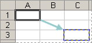

# Introduction aux cellules

Une cellule est l'élément unitaire fondamental d'une feuille de calcul. Vide par défaut, elle peut cependant contenir une valeur. La valeur d'une cellule possède deux caractéristiques essentielles :

1. **Son type de donnée** qui se distingue principalement en :
   * valeur littérale numérique (un nombre). Par exemple : *3,1415927*, *58%*, ou *1984*
   * valeur littérale alphanumérique (du texte). Par exemple : *Tableau2*, *Titre* ou *Nom*
   * des formules, c'est-à-dire une expression représentant un calcul en fonction de données. Les formules sont évaluées par le tableur. Le texte, les chiffres et les formules que vous tapez dans une cellule sont immédiatement affichés dans la barre de formule
2. **Son style**, qui se décompose en :
    * style de valeur (dépendant du type de données considérées. Par exemple : une date, un nombre, du texte, une valeur monétaire, etc.)
    * style de cellule (indépendant du contenu. Par exemple, mettre le texte en rouge et gras)

Une cellule Excel peut contenir jusqu'à 65 000 caractères. La quantité de texte affichable dans une cellule dépend de la largeur de la colonne qui contient la cellule, de la mise en forme de la cellule et de son contenu.

Lorsqu'une feuille de calcul est active, au moins une cellule est active. Elle est généralement représentée avec une bordure plus épaisse, vert foncé. Le contenu d'une cellule active est affiché dans la barre de formule et son adresse (ou son nom si il lui en a été attribué un) dans la zone d'adresse située en haut à gauche.

## Adresse (coordonnées) d'une cellule

Une cellule est l'intersection entre une colonne (représentée par une ou plusieurs lettres) et une ligne (représentée par un numéro). Le nom combiné de la colonne et de la ligne d'une cellule définit son **adresse**.

Ainsi, dans l'image ci-dessus, la cellule **C4** désigne l'intersection entre la 3ème colonne et la quatrième ligne.

## Références à une cellule

### Référence relative

Par défaut, une référence de cellule est une référence relative, ce qui signifie que la référence est relative à l'emplacement de la cellule. Par exemple, si vous faites référence à la cellule **A2** dans la cellule **C2**, vous référencez en fait la cellule située deux colonnes à gauche (C moins A), sur la même ligne (2).

Lorsque vous copiez une formule contenant une référence de cellule relative, la formule se mettra à jour automatiquement avec une nouvelle référence relative.

### Référence absolue

Une référence absolue représente le moyen de désigner une cellule de façon unique dans une feuille de calcul. 
Une référence absolue à une cellule se fait en précédant le numéro de colonne et le numéro de ligne par le signe **$**.

Par exemple, **$C$7** pour la cellule située à l'intersection de la colonne notée **C** et de la ligne **7**.

Lorsque vous copiez une formule contenant une référence de cellule absolue, la formule conservera la référence absolue sans la modifier.

### Référence mixte

Une référence mixte est une référence dans laquelle la position horizontale de la cellule est exprimée de manière absolue et la position verticale de façon relative, ou inversement.

Par exemple : **$A4** ou **B$7**

### Comprendre les différentes références par l'exemple

Le tableau ci-dessous résume la façon dont un type de référence se met à jour si une formule contenant la référence est copiée deux cellules vers le bas et deux cellules vers la droite.

| Pour une formule copiée : | Si la référence est : | Elle passe à : |
|---|---|---|
|  | **$A$1** (colonne absolue et ligne absolue) | **$A$1** (la référence est absolue) |
|   | **A$1** (colonne relative et ligne absolue) | **C$1** (la référence est mixte) |
|   | **$A1** (colonne absolue et ligne relative) | **$A3** (la référence est mixte) |
|   | **A1** (colonne relative et ligne relative) | **C3** (la référence est relative) |

### Basculer d'un type de référence de celulle à un autre

Pour modifier le type de référence de cellule :

1. Sélectionnez la cellule qui contient la formule
2. Dans la barre de formule, sélectionnez la référence à modifier
3. Appuyez sur F4 pour passer au type de référence suivant

### Donner un nom à une cellule ou à une plage de cellules

Il est possible de donner un nom à une cellule ou une plage de cellules. Ainsi plutôt que de faire référence aux coordonnées de la cellule, il sera posible d'y faire référence avec un nom plus représentatif des données qui y sont associées.

Pour nommer une cellule ou une plage de cellules :

1. Sélectionner la cellule (ou la plage de cellules) à nommer
2. Remplacer les coordonnées de la cellule (ou de la plage de cellules) par le nom que vous souhaitez utiliser

Vous pouvez aussi utiliser le menu ***Formules > Gestionnaire de noms*** pour gérer tous les noms de votre classeur.

## Commentaire

Il est possible d'ajouter un commentaire à une cellule afin de fournir des informations additionnelles que l'on ne souhaite pas voir figurer dans la feuille de calcul.

Pour ajouter un commentaire à une cellule, il faut :

1. Sélectionner la cellule où insérer le commentaire
2. Cliquer dessus avec le bouton droit de la souris
3. Choisir insérer un commentaire

## Exercices

À venir.