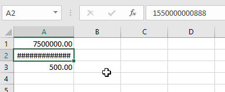
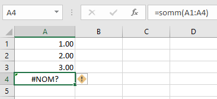
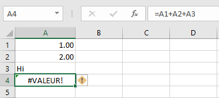
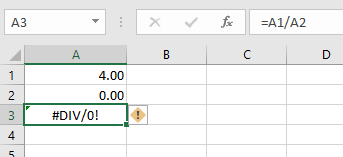
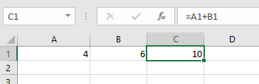
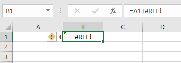

# Les principales erreurs Excel

## L'erreur **#######**

**Cause** : La largeur de la colonne n'est pas assez grande pour afficher la valeur.  
**Solution** : Augmenter la largeur de la colonne.

## L'erreur **#NOM?**

**Cause** : Excel ne reconnaît pas la formule utilisée.  
**Solution** : Corriger le nom de la formule pour utiliser ***SOMME***.

## L'erreur **#VALUE!**

**Cause** : Un des arguments de la formule utilisée n'est pas du bon format.  
**Solution** : Supprimer l'argument ou changer la valeur de la cellule **A3** pour un nombre.

## L'erreur **#DIV/0!**

**Cause** : Une division par zéro s'est produite dans une formule.  
**Solution** : Changer la valeur de la cellule **A2** pour un nombre différent de 0 ou utiliser la formule **SI(A2=0,"",A1/A2)** pour empêcher l'erreur de se produire.

## L'erreur **#REF!**

Cette erreur se produira après avoir supprimer la colonne B.

**Cause** : La référence à B1 dans la formule de la cellule **B1** n'existe plus (la colonne a été supprimée!).  
**Solution** : Corriger la formule en supprimant  **+/REF!** ou annuler votre changement (la colonne qui a été supprimée) en utilisant le raccourci clavier **CTRL+Z**.